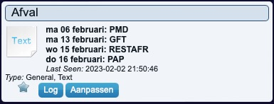

# Circulus Garbage collector

This plugin is showing the garbage collector dates of the Circulus company for yor postal code and house number.

## Parameters
| Parameter             | Description
| :---                  | :---
| **Postal&nbsp;code&nbsp;(NL)**  | Enter your postal code in the format 1234AB
| **House&nbsp;number**      | Enter your house number
| **IP Address** | Circulus IP Address, default: mijn.circulus.nl
| **Debug**             | False

## Devices
The following parameters are displayed:

| Name      | Description
| :---      | :---
| **Garbage** | Displays the next dates for the garbage collection
| **Garbage alert** | Gives you an alert for the next garbage collection
| **Garbage today** | Indicator for garbage today

